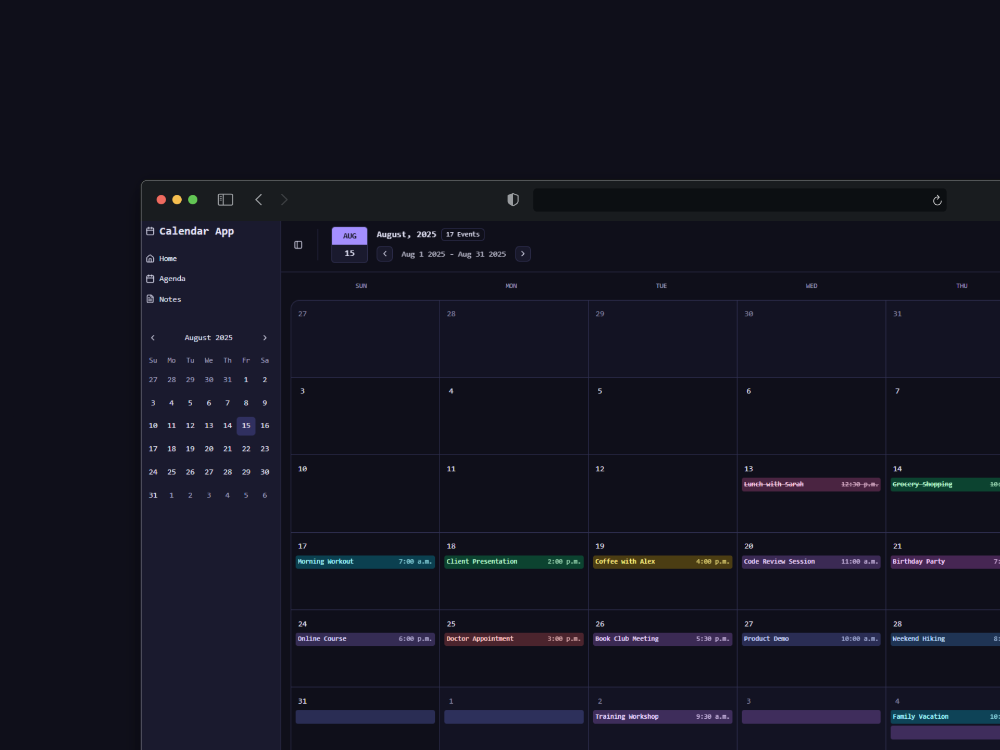
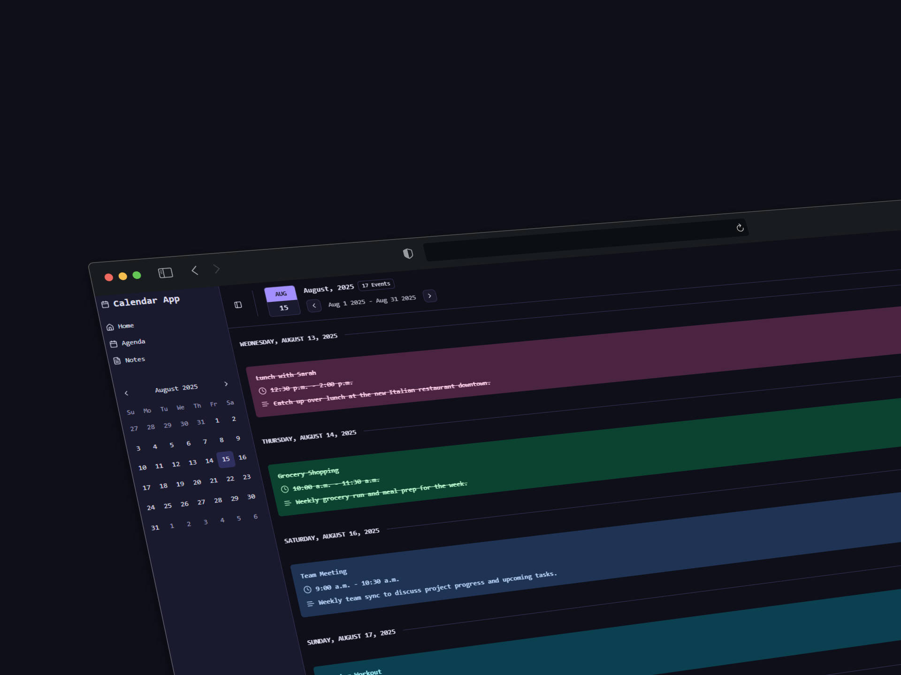

# Notes Calendar

A modern and intuitive calendar application for organizing events, managing your agenda, and keeping track of your notes all in one place.

## ✨ Features

- **📅 Event Management**: Create, edit, and delete calendar events with detailed information
- **📝 Rich Notes**: Write and organize notes with rich text formatting using a powerful editor
- **🎨 Color Coding**: Organize events and notes with customizable color themes
- **📱 Responsive Design**: Seamless experience across desktop and mobile devices
- **🌙 Dark Mode**: Toggle between light and dark themes
- **🔄 Drag & Drop**: Reorder notes with intuitive drag and drop functionality
- **📊 Agenda View**: Clean agenda layout showing upcoming events
- **💾 Persistent Storage**: All data is automatically saved locally

## 🚀 Tech Stack

- **[React](https://reactjs.org/)** - UI library for building user interfaces
- **[TypeScript](https://www.typescriptlang.org/)** - Type-safe JavaScript development
- **[Zustand](https://zustand-demo.pmnd.rs/)** - Lightweight state management
- **[Shadcn/ui](https://ui.shadcn.com/)** - Beautiful and accessible UI components
- **[Motion](https://motion.dev/)** - Smooth animations and transitions
- **[Tailwind CSS](https://tailwindcss.com/)** - Utility-first CSS framework
- **[Tanstack Router](https://tanstack.com/router)** - Type-safe routing
- **[Tiptap](https://tiptap.dev/)** - Rich text editor for notes
- **[date-fns](https://date-fns.org/)** - Modern JavaScript date utility library
